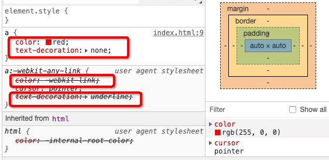
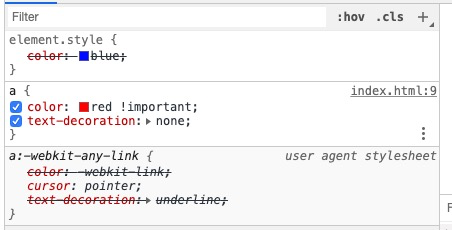
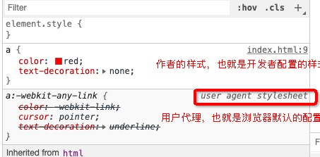
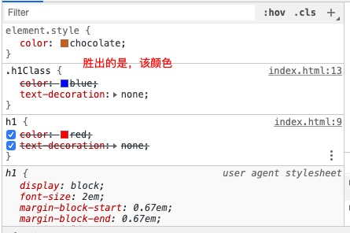
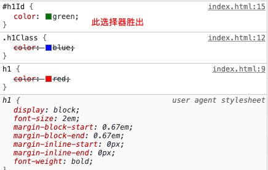
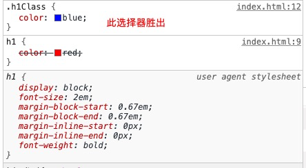
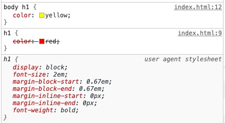
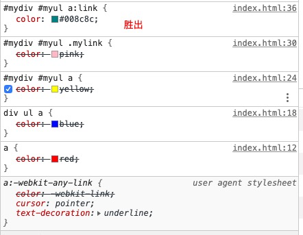
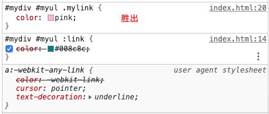

# HTML和CSS零基础权威入门 {ignore} 
# 3-4 层叠 {ignore}

# 声明冲突

同一个样式，多次应用到同一个元素

```html
<!DOCTYPE html>
<html lang="en">
<head>
    <meta charset="UTF-8">
    <meta name="viewport" content="width=device-width, initial-scale=1.0">
    <meta http-equiv="X-UA-Compatible" content="ie=edge">
    <title>Document</title>
    <style>
        a{
            color: red;
            text-decoration: none;
        }
    </style>
</head>
<body>
    <a href="">Lorem.</a>
    <a href="">Culpa.</a>
    <a href="">Explicabo.</a>
    <a href="">Exercitationem!</a>
    <a href="">Vel!</a>
    <a href="">Molestias.</a>
    <a href="">Velit.</a>
    <a href="">Veniam.</a>
    <a href="">Suscipit.</a>
    <a href="">Eius!</a>
</body>
</html>
```
效果如下：



新添加的样式表，会影响之前的样式，这样对a元素来说，就产生了声明冲突

# 层叠 (权重计算)

解决声明冲突的过程，叫层叠（是浏览器自动处理）

我们需要了解到的是，浏览器是怎么处理的，只有了解了浏览器怎么处理层叠样式， 才能更好的在开发网页的过程中，使用层叠的权重计算，做一些规范化的处理

## 第一步 比较重要性

从高到低的权重分类

###1. 作者(开发者)样式表的 !important 样式（建议一般不要加）
```html
<!DOCTYPE html>
<html lang="en">
<head>
    <meta charset="UTF-8">
    <meta name="viewport" content="width=device-width, initial-scale=1.0">
    <meta http-equiv="X-UA-Compatible" content="ie=edge">
    <title>Document</title>
    <style>
        a{
            /*此处的color元素的权重配比了 !important 属性，说明权重等级是最高的，所以下面的 内联样式就无法生效*/
            color: red !important;
            text-decoration: none;
        }
    </style>
</head>
<body>
    <a href="" style="color: blue;">Lorem.</a>
</body>
</html>
```

###2. 作者样式表中的普通样式
```html
<!DOCTYPE html>
<html lang="en">
<head>
    <meta charset="UTF-8">
    <meta name="viewport" content="width=device-width, initial-scale=1.0">
    <meta http-equiv="X-UA-Compatible" content="ie=edge">
    <title>Document</title>
    <style>
        a{
            /*此内部样式配置，是开发者自己手动添加的配置，此处的权重配置，高于浏览器默认的属性配置*/
            color: red;
            text-decoration: none;
        }
    </style>
</head>
<body>
    <a href="">Lorem.</a>
</body>
</html>
```

###3. 浏览器默认样式表

浏览器会默认为一些元素配置一些样式，比如a元素，h1元素，h2元素,p元素等

```html
<!DOCTYPE html>
<html lang="en">
<head>
    <meta charset="UTF-8">
    <meta name="viewport" content="width=device-width, initial-scale=1.0">
    <meta http-equiv="X-UA-Compatible" content="ie=edge">
    <title>Document</title>
</head>
<body>
    <a href="">Lorem.</a>
    <p>Lorem.</p>
    <h1>Lorem.</h1>
</body>
</html>
```


## 第二步 比较特殊性

当第一步 比较重要性 的结果 还有一部分权重没有比较出来的时候，需要比较特殊性，比较特殊性的总体规则就是看选择器，选择器选中的范围越窄，越特殊。

像Id选择器，选择的范围就是一个元素，所以特殊性越高，像通配符选择器，元素选择器，选择的范围越广，特殊性越低

```html
<!DOCTYPE html>
<html lang="en">
<head>
    <meta charset="UTF-8">
    <meta name="viewport" content="width=device-width, initial-scale=1.0">
    <meta http-equiv="X-UA-Compatible" content="ie=edge">
    <title>Document</title>
    <style>
        /*比如，下面的三个样式，都是针对于h1元素的样式，然而这写都是作者书写的样式，所以比较重要性，就比较不出来权重的大小，就要进行特殊性的比较, 发现，ID选择器的特殊性很高，所以这里显示ID选择性的样式*/
        h1{
            color: red;
            text-decoration: none;
        }
        .h1Class{
            color: blue;
            text-decoration: none;
        }
        #h1Id{
            color: green;
            text-decoration: line-through;
        }
    </style>
</head>
<body>
    <h1 class="h1Class" id="h1Id">Lorem, ipsum.</h1>
</body>
</html>
```
关于特殊性的规则，哪种选择器的特殊性低，低到什么程度，这里把他揉开了将一下

具体规则：通过选择器的冲突属性（比如上面的color属性,text-decoration属性都冲突了）所在的选择器，计作一个四位数 每个位数的范围是0-255（和颜色的取值空间类似）

 千位 | 百位 | 十位 | 个位
 - | - | - | -
 0-255 | 0-255 | 0-255 | 0-255

可以把权重的特殊性的值，想象一个四位数

### 1. 千位：如果是内联样式，计作1，否则计作0

```html
<!DOCTYPE html>
<html lang="en">
<head>
    <meta charset="UTF-8">
    <meta name="viewport" content="width=device-width, initial-scale=1.0">
    <meta http-equiv="X-UA-Compatible" content="ie=edge">
    <title>Document</title>
    <style>
        h1{
            /*这里的color声明冲突，所在的选择器是元素选择器，不是内联选择器，所以千位计作0， color 对应的四位数 0 X X X*/
            color: red;
            text-decoration: none;
        }
        .h1Class{
            /*这里的color声明冲突，所在的选择器是类选择器，不是内联选择器，所以千位计作0， color 对应的四位数 0 X X X*/
            color: blue;
            text-decoration: none;
        }
    </style>
</head>
<body>
    <!-- 比较特殊性的时候 发现这里有color属性，有声明冲突的情况，那么看到这里的color所在的选择器是内联选择器，根据内联选择器千为计作1的规则 所以这里的 color: 对应的四位数 1 X X X -->
    <h1 class="h1Class" style="color: chocolate;">Lorem, ipsum.</h1>
</body>
</html>
```
所以上面的color元素，所在的选择器对应的四位数中，姑且不看百位，十位，个位，因为存在内联选择器，所以 千位 就可以直接判断出 谁的特殊性最高，所以这里显示的是 


### 2. 百位： 等于选择器中所有id选择器的数量

```html
<!DOCTYPE html>
<html lang="en">
<head>
    <meta charset="UTF-8">
    <meta name="viewport" content="width=device-width, initial-scale=1.0">
    <meta http-equiv="X-UA-Compatible" content="ie=edge">
    <title>Document</title>
    <style>
        h1{
            /*元素选择器，color对应的四位数是：0 0 X X*/
            color: red;
        }
        .h1Class{
            /*类选择器，color对应的四位数是：0 0 X X*/
            color: blue;
        }
        #h1Id{
            /*id选择器，color对应的四位数是：0 1 X X 所以此选择器胜出*/
            color: green;
        }
    </style>
</head>
<body>
    <h1 class="h1Class" id="h1Id">Lorem, ipsum.</h1>
</body>
</html>
```


### 3. 十位：等于选择器中所有类选择器，属性选择器，伪类选择器的数量

```html
<!DOCTYPE html>
<html lang="en">
<head>
    <meta charset="UTF-8">
    <meta name="viewport" content="width=device-width, initial-scale=1.0">
    <meta http-equiv="X-UA-Compatible" content="ie=edge">
    <title>Document</title>
    <style>
        h1{
            /*元素选择器，color对应的四位数就是：0 0 0 X*/
            color: red;
        }
        .h1Class{
            /*类选择器：colro对应的四位数是：0 0 1 X 所以胜出*/
            color: blue;
        }
    </style>
</head>
<body>
    <h1 class="h1Class">Lorem, ipsum.</h1>
</body>
</html>
```


### 4. 个位： 等于选择器中所有元素选择器，伪元素选择器的数量

```html
<!DOCTYPE html>
<html lang="en">
<head>
    <meta charset="UTF-8">
    <meta name="viewport" content="width=device-width, initial-scale=1.0">
    <meta http-equiv="X-UA-Compatible" content="ie=edge">
    <title>Document</title>
    <style>
        /*元素选择器 此处为一个元素 所以color对应的四位数就是：0 0 0 1*/
        h1{
            color: red;
        }
        /*也是元素选择器 此处为两个元素 所以color对应的四位数是：0 0 0 2 所以此选择器胜出*/
        body h1 {
            color: yellow;
        }
    </style>
</head>
<body>
    <h1 title="Lorem" class="h1Class">Lorem, ipsum.</h1>
</body>
</html>
```



### 例子

```html
<!DOCTYPE html>
<html lang="en">
<head>
    <meta charset="UTF-8">
    <meta name="viewport" content="width=device-width, initial-scale=1.0">
    <meta http-equiv="X-UA-Compatible" content="ie=edge">
    <title>Document</title>
    <style>
        /*从重要性角度比较，以下样式都是作者样式表，所以需要比较特殊性
            要从特殊性的几个角度
        */
        a{
            /*只有一个元素选择器，
                所以color对应的四位数是： 0 0 0 1*/
            color: red;
        }

        div ul a {
            /*有三个元素选择器，分别是div, ul a 
                所以color对应的四位数是：0 0 0 3*/
            color: blue;
        }

        #mydiv #myul a {
            /*有两个ID选择器，一个元素选择器a 
                所以color对应的四位数是：0 2 0 1*/
            color: yellow;
        }

        #mydiv #myul .mylink{
            /*有两个ID选择器，一个类选择器
                所以color对应的四位数是：0 2 1 0*/
            color: pink;
        }

        #mydiv #myul a:link{
            /*有两个ID选择器，一个伪类选择器:link, 一个元素选择器a
                所以color对应的四位数是：0 2 1 1*/
            color: #008c8c;
        }
        /*结论：综上对比，可以看到color声明冲突的最后胜出者是 color：#008c8c；*/
    </style>
</head>
<body>
    <div id="mydiv">
        <ul id="myul">
            <li id="myli">
                <a href="" class="mylink">
                    层叠样式例子
                </a>
            </li>
        </ul>
    </div>
</body>
</html>
```


## 第三步 比较源次序

如果出现最后特殊性一样的，还是比较不了的话，就要用到该对比。

### 书写靠后的胜出

```html
<!DOCTYPE html>
<html lang="en">
<head>
    <meta charset="UTF-8">
    <meta name="viewport" content="width=device-width, initial-scale=1.0">
    <meta http-equiv="X-UA-Compatible" content="ie=edge">
    <title>Document</title>
    <style>
        /*从重要性角度比较，以下样式都是作者样式表，所以需要比较特殊性
            要从特殊性的几个角度, 特殊性的角度比较晚了之后，发现如下的两个
            特殊性一样的样式，要从源次序上进行比较，靠后的胜出
        */

        #mydiv #myul :link{
            /*有两个ID选择器，一个伪类选择器:link
                所以color对应的四位数是：0 2 1 0*/
            color: #008c8c;
        }

        #mydiv #myul .mylink{
            /*有两个ID选择器，一个类选择器
                所以color对应的四位数是：0 2 1 0*/
            color: pink;
        }

        /*结论：综上对比，可以看到color声明冲突的最后胜出者是 color：#008c8c；*/
    </style>
</head>
<body>
    <div id="mydiv">
        <ul id="myul">
            <li id="myli">
                <a href="https://163.com" class="mylink">
                    层叠样式例子
                </a>
            </li>
        </ul>
    </div>
</body>
</html>
```



## 使用场景

### 1 重置样式表

通过书写作者样式，去覆盖浏览器的一些默认样式，因为不同的浏览器，在处理一些默认样式的时候，是有差异的，导致我们的网页在不同浏览器上展示就出现了不同效果的展示，这显然不是我们要的效果，我们想要的是，在不同的浏览器展示相同的效果 

所以我们通常会写一些样式，去覆盖浏览器的默认样式

通常网上有一些现成的重置样式表，直接拿来用就可以了

normalize.css, reset.css, meyer.css

上面三个重置样式表，都差不多，下面是meyer.css的链接

链接：https://meyerweb.com/eric/tools/css/reset/

```css
/* http://meyerweb.com/eric/tools/css/reset/ 
   v2.0 | 20110126
   License: none (public domain)
*/

html, body, div, span, applet, object, iframe,
h1, h2, h3, h4, h5, h6, p, blockquote, pre,
a, abbr, acronym, address, big, cite, code,
del, dfn, em, img, ins, kbd, q, s, samp,
small, strike, strong, sub, sup, tt, var,
b, u, i, center,
dl, dt, dd, ol, ul, li,
fieldset, form, label, legend,
table, caption, tbody, tfoot, thead, tr, th, td,
article, aside, canvas, details, embed, 
figure, figcaption, footer, header, hgroup, 
menu, nav, output, ruby, section, summary,
time, mark, audio, video {
	margin: 0;
	padding: 0;
	border: 0;
	font-size: 100%;
	font: inherit;
	vertical-align: baseline;
}
/* HTML5 display-role reset for older browsers */
article, aside, details, figcaption, figure, 
footer, header, hgroup, menu, nav, section {
	display: block;
}
body {
	line-height: 1;
}
ol, ul {
	list-style: none;
}
blockquote, q {
	quotes: none;
}
blockquote:before, blockquote:after,
q:before, q:after {
	content: '';
	content: none;
}
table {
	border-collapse: collapse;
	border-spacing: 0;
}
```

### 2 爱恨法则 

主要针对于 a元素的伪类的书写规则，谁在前 谁在后

link > visited > hover > active

love hate 法则

### 3 项目迭代时，样式，皮肤更新

根据层叠的 权重计算，当有新的需求变更时，更推荐的做法是新建一个新的css文件，不要去修改以前的代码，将所该需求的权重配比值增加，利用层叠的规则 覆盖以前的css样式，就相当于过节的时候，各大网站更改皮肤似的。
