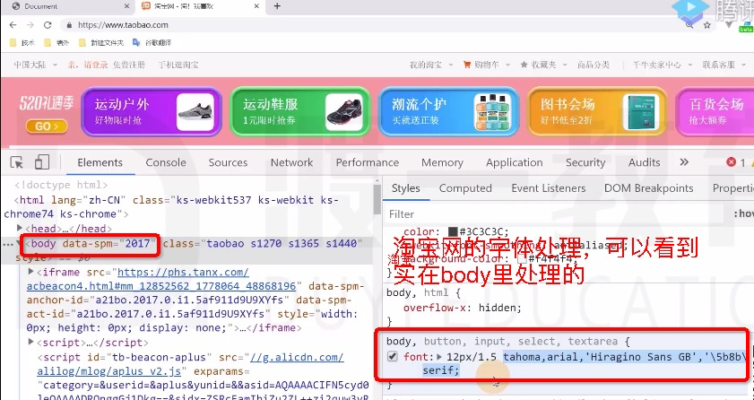
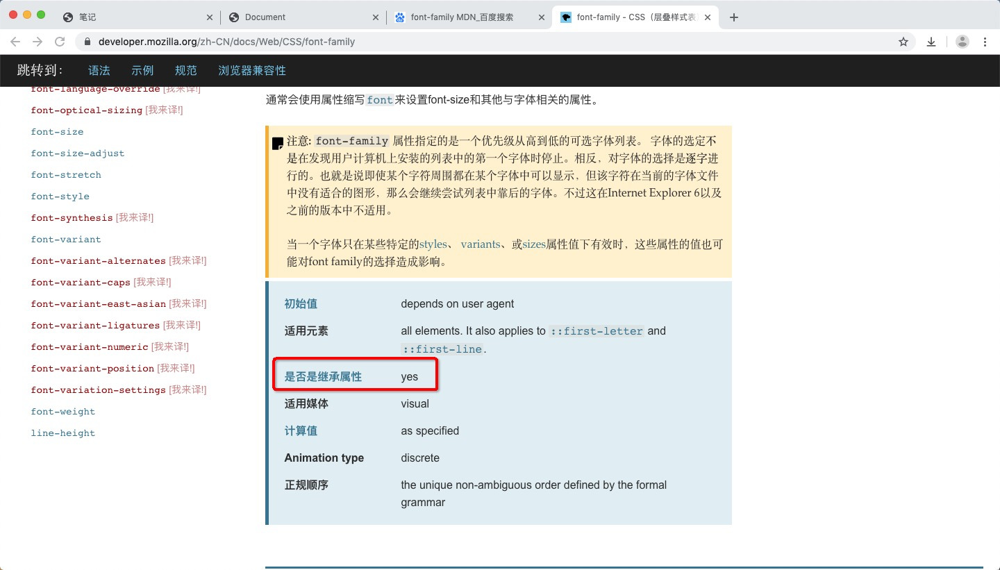
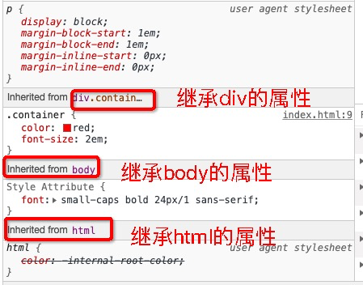
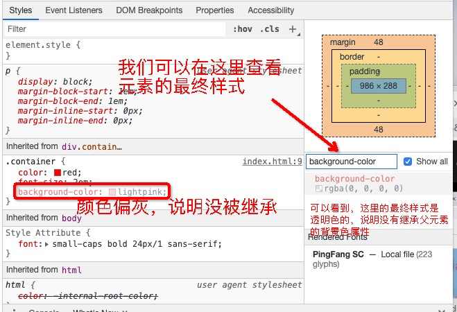

# HTML和CSS零基础权威入门 {ignore} 
# 3-5 继承 {ignore}

## 子元素会继承父元素的某些CSS属性

我们先来看一个例子：

```html
<!DOCTYPE html>
<html lang="en">
<head>
    <meta charset="UTF-8">
    <meta name="viewport" content="width=device-width, initial-scale=1.0">
    <meta http-equiv="X-UA-Compatible" content="ie=edge">
    <title>Document</title>
    <style>
        .container{
            color: red;
            font-size: 2em;
        }
    </style>
</head>
<body>
    <!--如果 我要给p元素，li元素，h1元素的内容 设置统一样式 一般的做法就是在每个元素上 添加相应的选择器，但是这样会显的代码会有冗余，所以 这里会用到继承的概念，在父元素div上 增加选择器，通过继承的理念 子元素会用到父元素的某些CSS样式-->
    <div class="container">
        <p>Lorem ipsum dolor sit amet consectetur adipisicing elit. Atque, accusantium. Reprehenderit sequi impedit ipsum explicabo pariatur voluptate numquam ipsa architecto. Dolores quidem doloremque vel ducimus harum labore enim sed et!</p>
        <ul>
            <li>Lorem.</li>
            <li>Repellendus!</li>
            <li>Voluptatibus?</li>
            <li>Vitae.</li>
            <li>Totam!</li>
            <li>Corporis!</li>
            <li>Hic.</li>
            <li>Molestias.</li>
            <li>Culpa.</li>
            <li>Tempore.</li>
        </ul>
        <h1>Lorem ipsum dolor sit amet.</h1>
    </div>
</body>
</html>
```

**注意：这里子元素继承父元素是某些CSS元素，不是全都能继承**

## 哪些CSS元素可以被继承呢？

### 1, 通常和文字相关的属性，都能被继承

font-size, color, font-weight, font-style ...

**因为字体通常是统一的，所以通常会把字体的样式，放在body元素的选择器里进行处理**

```html
<body style="font: ...">
    ....
</body>
```


### 2, 怎么看哪些能不能被继承呢？

要在标准规范的MDN/W3C文档里查看，在对属性的解释说明里，有 是否是继承属性这一说明



相关链接：https://developer.mozilla.org/zh-CN/docs/Web/CSS/font-family

### 3, 在浏览器的调试模式状态下也可以看到继承关系
```html
<!DOCTYPE html>
<html lang="en">
<head>
    <meta charset="UTF-8">
    <meta name="viewport" content="width=device-width, initial-scale=1.0">
    <meta http-equiv="X-UA-Compatible" content="ie=edge">
    <title>Document</title>
    <style>
        .container{
            color: red;
            font-size: 2em;
        }
    </style>
</head>
<body style="font: small-caps bold 24px/1 sans-serif;">
    <div class="container">
        <p>Lorem ipsum dolor sit amet consectetur adipisicing elit. Atque, accusantium. Reprehenderit sequi impedit ipsum explicabo pariatur voluptate numquam ipsa architecto. Dolores quidem doloremque vel ducimus harum labore enim sed et!</p>
        <ul>
            <li>Lorem.</li>
            <li>Repellendus!</li>
            <li>Voluptatibus?</li>
            <li>Vitae.</li>
            <li>Totam!</li>
            <li>Corporis!</li>
            <li>Hic.</li>
            <li>Molestias.</li>
            <li>Culpa.</li>
            <li>Tempore.</li>
        </ul>
        <h1>Lorem ipsum dolor sit amet.</h1>
    </div>
</body>
</html>
```


### 4, 浏览器的调试状态看不能被继承的属性

```html
<!DOCTYPE html>
<html lang="en">
<head>
    <meta charset="UTF-8">
    <meta name="viewport" content="width=device-width, initial-scale=1.0">
    <meta http-equiv="X-UA-Compatible" content="ie=edge">
    <title>Document</title>
    <style>
        .container{
            color: red;
            font-size: 2em;
            /*给body元素 加了一个背景色 然后看p元素是否被继承了该属性*/
            background-color: lightpink;
        }
    </style>
</head>
<body style="font: small-caps bold 24px/1 sans-serif;">
    <div class="container">
        <!-- 调试模式下，观察有没有继承父元素的 background-color属性-->
        <p>Lorem ipsum dolor sit amet consectetur adipisicing elit. Atque, accusantium. Reprehenderit sequi impedit ipsum explicabo pariatur voluptate numquam ipsa architecto. Dolores quidem doloremque vel ducimus harum labore enim sed et!</p>
    </div>
</body>
</html>
```


页面呈现的效果如上所示，好像是p元素继承了父元素的背景色，但是我们打开调试模式看一下



