# HTML和CSS零基础权威入门 {ignore} 
# 3-6 属性值的计算过程 {ignore}

属性值的计算过程是相当相当复杂的，所以了解核心点就行了，
了解了核心点，就知道浏览器是怎么处理css层叠样式的，怎么渲染的，
太细节的东西对开发也没什么作用

# 渲染方式

浏览器渲染元素是一个元素一个元素渲染的，渲染顺序是按照页面结构的树形目录进行渲染的　

我们的页面写完了之后，结构一定是如下所示

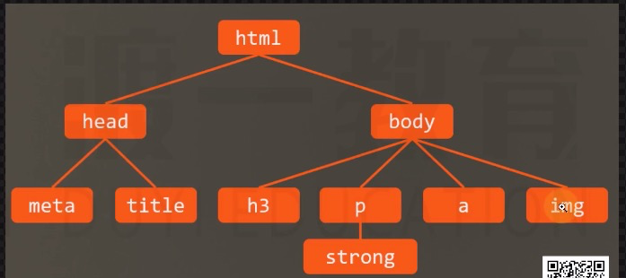

根节点，一定是html元素， 渲染的过程是从上到下

渲染过程： html -> head -> mate -> title -> body ->h3 -> p -> strong -> a -> img;

我们这里探讨的不是整体的渲染过程，整体的渲染过程很简单，从上往下依次渲染就可以了，我们这里的讨论的是渲染每一个元素，它是怎么渲染的。

# 每个元素的渲染

渲染条件：渲染每个元素的前提条件，是该元素的所有CSS属性必须有值。有一个css属性没有值，就渲染不出来。

那么这么的所有的css属性有多少呢，如下图所示

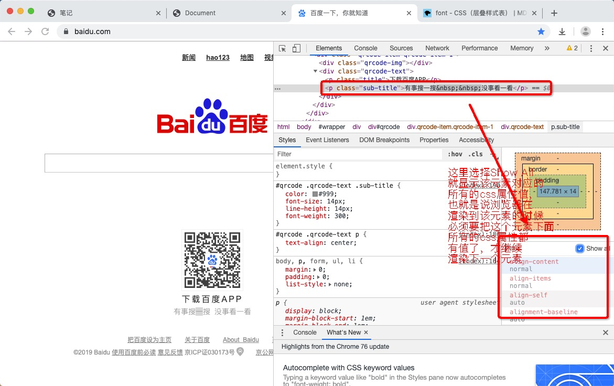

只有全部的css属性都确定下来，都有值了，浏览器才知道这个元素应该是怎么一个呈现效果，然后在计算下一个元素的所有属性值

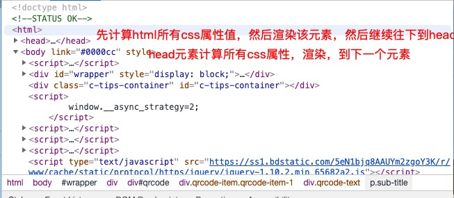


# 属性值计算过程

## 简介

一个元素从所有属性一开始都没有值，到所有的属性都有值，这个计算过程，叫属性值计算过程.

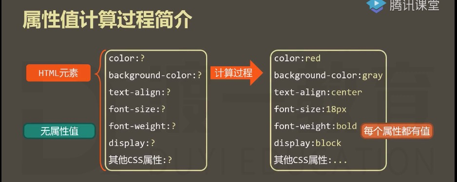


## 如何计算

四个步骤

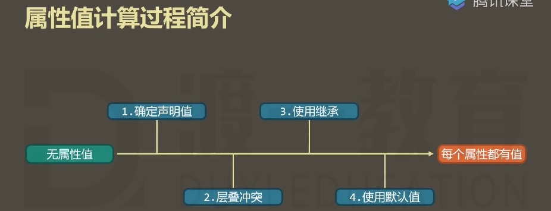

### 1，确定声明值

作者写的样式，或者浏览器给的样式，都是声明值

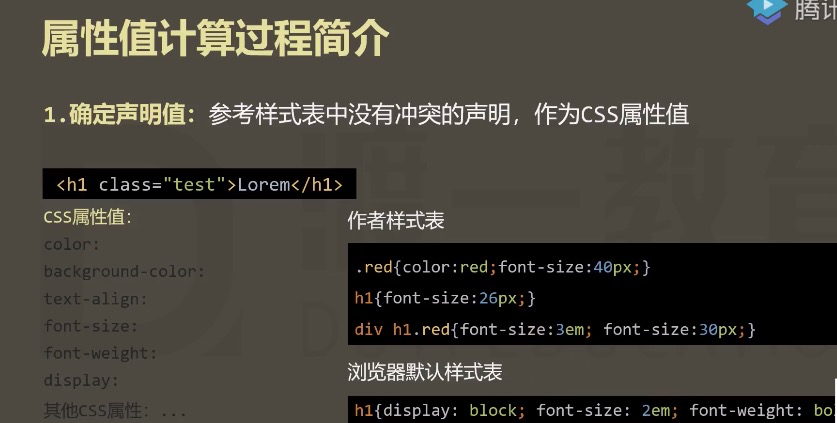

再如上图所示，找出没有声明冲突的声明，直接作为css属性值

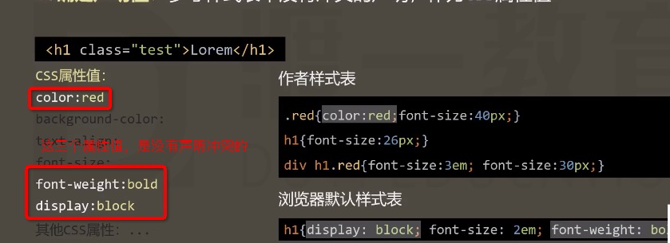


### 2，层叠冲突

对样式表中 有冲突的声明使用层叠规则

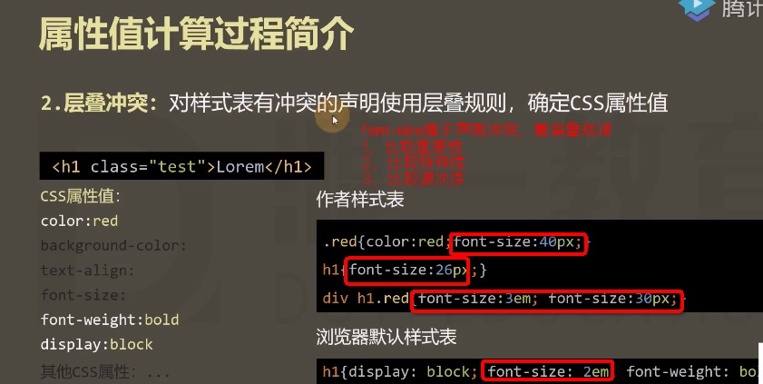

层叠比较后

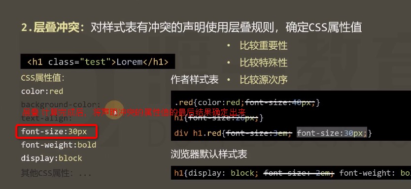

### 3，使用继承

因为CSS的属性值非常的多，所以还会有很多没有值的属性

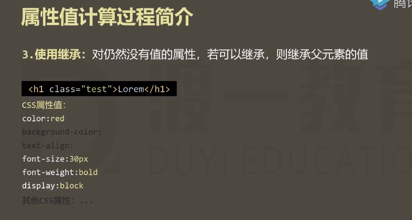

对仍然没有值的属性，若可以继承，则继承父元素的值

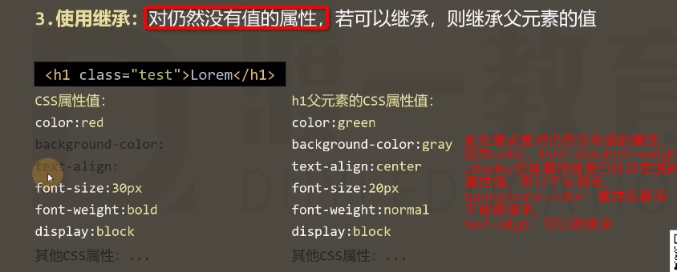

所以 继承后如下图所示

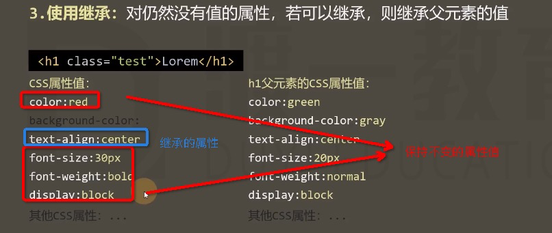

### 4，使用默认值

继承之后，应该还会有很多属性没有值

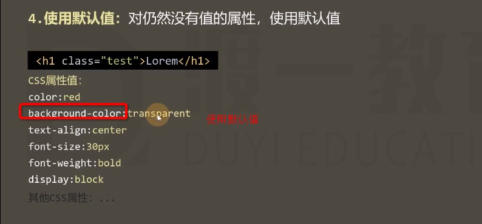

到这里所有的CSS属性就都有值了，因为所有的CSS属性，都会有一个默认值

如下图所示，就是 width属性的默认值

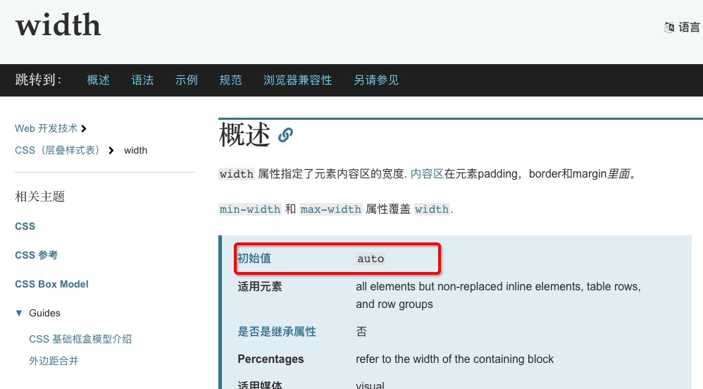

更多默认值链接：https://developer.mozilla.org/zh-CN/docs/Web/CSS/width

## chrome 调试看 属性的最终计算值

例子：
```html
<!DOCTYPE html>
<html lang="en">
<head>
    <meta charset="UTF-8">
    <meta name="viewport" content="width=device-width, initial-scale=1.0">
    <meta http-equiv="X-UA-Compatible" content="ie=edge">
    <title>Document</title>
</head>
<body>
    <h1>Lorem.</h1>
</body>
</html>
```
chorme调试模式下的computed窗口

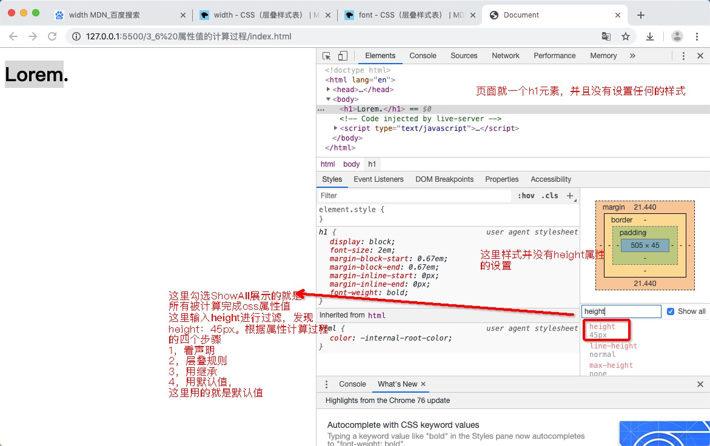

## 扩展一 面试题一

问：a元素的颜色是什么？

```html
<!DOCTYPE html>
<html lang="en">
<head>
    <meta charset="UTF-8">
    <meta name="viewport" content="width=device-width, initial-scale=1.0">
    <meta http-equiv="X-UA-Compatible" content="ie=edge">
    <title>Document</title>
    <style>
        div{
            color: red;
        }
    </style>
</head>
<body>
    <div>
        <a href="">举例</a>
    </div>
</body>
</html>
```
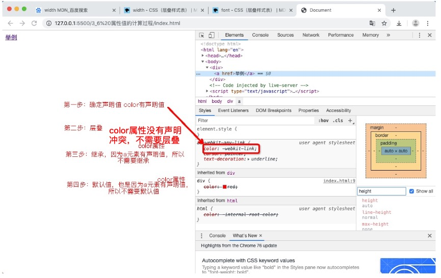

## 扩展二 强制继承 

如何将 扩展一的 a元素的颜色，继承div的颜色值呢，

扩展一个知识点，在重置样式表的时候，通常会把a元素的默认颜色改了，但是就像扩展一展示的那样，通过属性的计算过程发现a元素的color属性没有收父元素的影响 

这里使用强制继承

```html
<!DOCTYPE html>
<html lang="en">
<head>
    <meta charset="UTF-8">
    <meta name="viewport" content="width=device-width, initial-scale=1.0">
    <meta http-equiv="X-UA-Compatible" content="ie=edge">
    <title>Document</title>
    <style>
        div{
            color: red;
        }
        a{
            /*强制继承*/
            color: inherit;
        }
    </style>
</head>
<body>
    <div>
        <a href="">举例</a>
    </div>
</body>
</html>
```

我们再来看一下 属性的计算过程

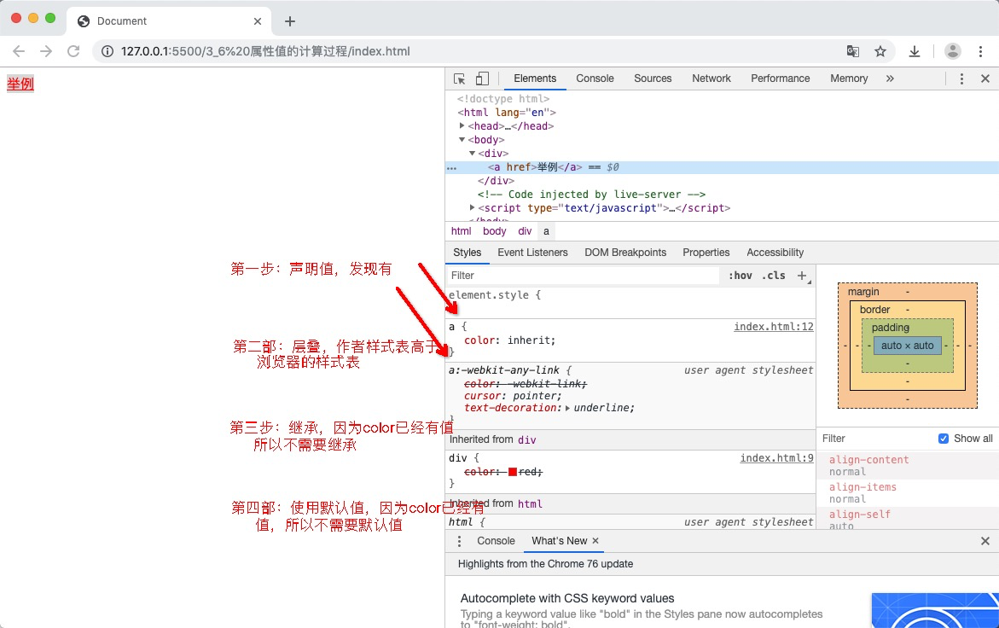

## 扩展三 初始值设定 

属性值：initial


