# HTML和CSS零基础权威入门 {ignore} 
# 3-8 盒模型应用 {ignore}

## 1. 改变宽，高范围

默认情况下，width 和 height  设置的是内容盒宽高。

> 页面重构师： 将psd文件转换成静态页面

### 实例分析

比如我们在做一个网页的图标时，通常使用某些工具去度量以下实际需求的大小，如下图所示，我要根据如下页游戏中心区域的设计稿，度量出宽度，和高度来

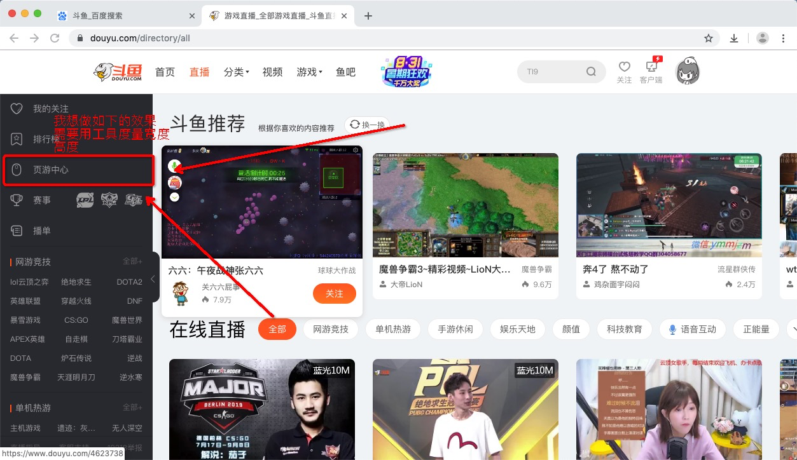

度量肯定需要一些专业话的工具，后期有介绍，这里先大概度量一下，度量结果如下所示 236 * 52

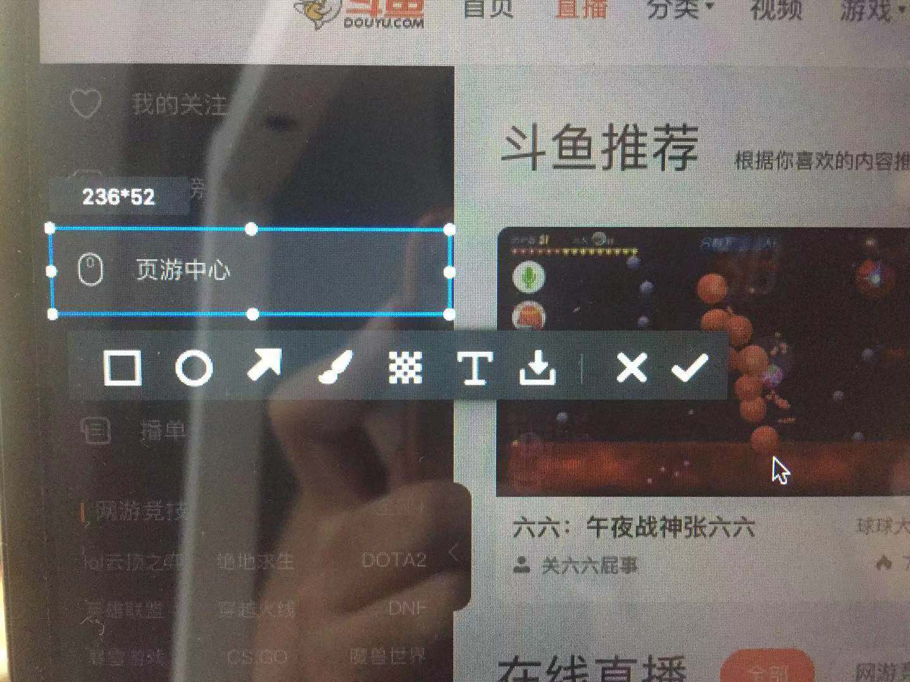

所以我们在做页面的时候，就会很自然的把这个 宽度，高度设置在我们页面样式表里 就像下面这样：
```html
<!DOCTYPE html>
<html lang="en">
<head>
    <meta charset="UTF-8">
    <meta name="viewport" content="width=device-width, initial-scale=1.0">
    <meta http-equiv="X-UA-Compatible" content="ie=edge">
    <title>Document</title>
    <style>
        div{
           width: 236px;
           height: 52px;
           color: #a7a7a7;
           background: #2d2e36;
           line-height: 52px;
        }
    </style>
</head>
<body>
    <div>
        页游中心
    </div>
</body>
</html>
```
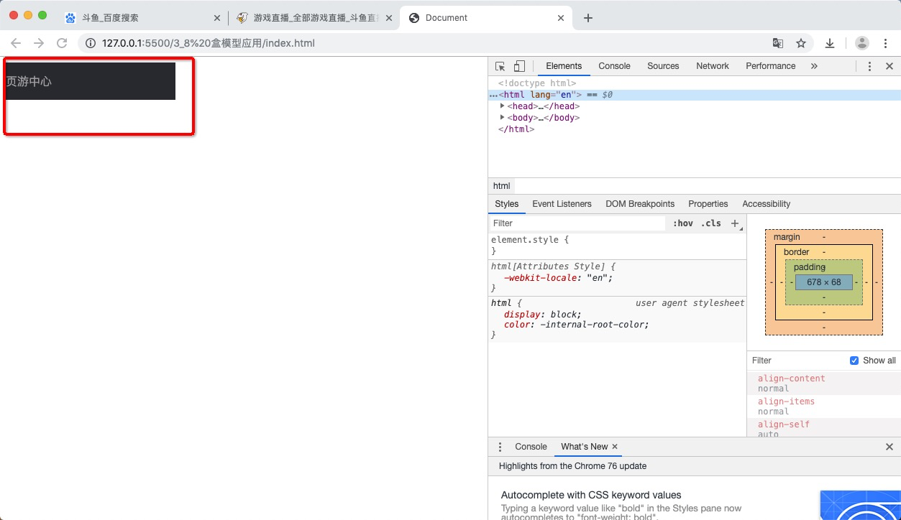

但因为 文字距离左边有段距离，所以我们需要设置 填充属性 padding-left

设置后如下图所示

```html
<!DOCTYPE html>
<html lang="en">
<head>
    <meta charset="UTF-8">
    <meta name="viewport" content="width=device-width, initial-scale=1.0">
    <meta http-equiv="X-UA-Compatible" content="ie=edge">
    <title>Document</title>
    <style>
        div{
           width: 236px;
           height: 52px;
           color: #a7a7a7;
           background: #2d2e36;
           line-height: 52px;
           /* 新增的属性，距离左边框的距离*/
           padding-left: 46px;
        }
    </style>
</head>
<body>
    <div>
        页游中心
    </div>
</body>
</html>
```

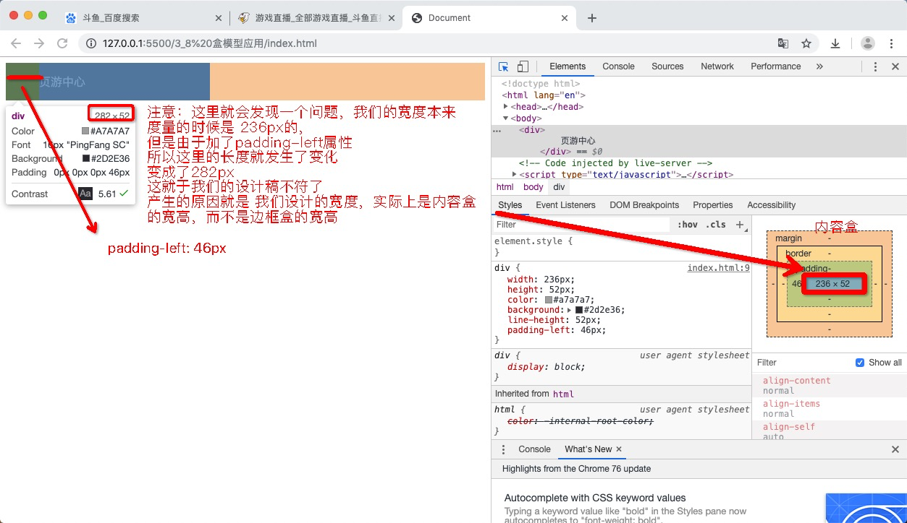

那么如何处理如上的情况，以便适配我们的设计稿呢？

两种方法：

1. 精确计算 （以前的处理方式）

根据边框区域，填充区域的距离，计算出内容区的实际宽，高

2. CSS3

box-sizing 属性

- content-box 宽度，高度是内容盒的宽高
- border-box  宽度，高度是边框盒的宽高，内容边框会自动推算出来
```html
<!DOCTYPE html>
<html lang="en">
<head>
    <meta charset="UTF-8">
    <meta name="viewport" content="width=device-width, initial-scale=1.0">
    <meta http-equiv="X-UA-Compatible" content="ie=edge">
    <title>Document</title>
    <style>
        div{
           width: 236px;
           height: 52px;
           color: #a7a7a7;
           background: #2d2e36;
           line-height: 52px;
           /* 新增的属性，距离左边框的距离*/
           padding-left: 46px;
           /*边框盒宽高设定*/
           box-sizing: border-box;
        }
    </style>
</head>
<body>
    <div>
        页游中心
    </div>
</body>
</html>
```
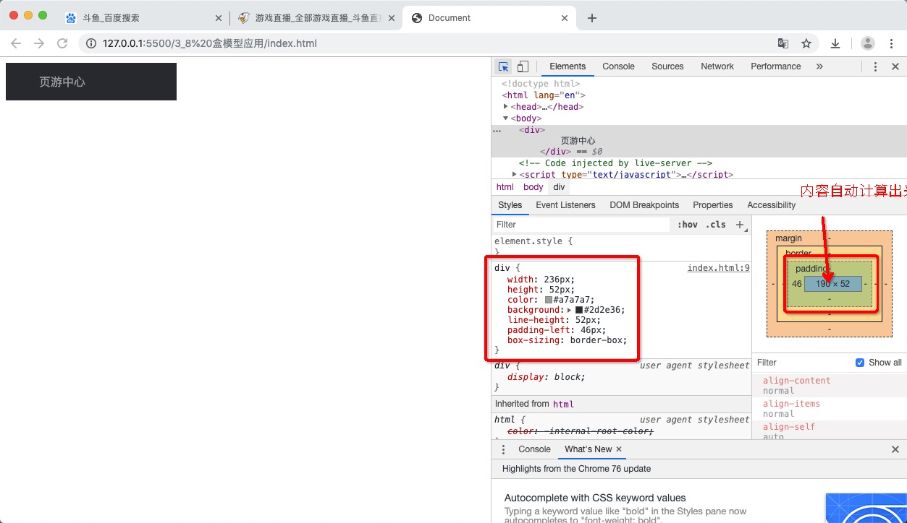

## 2. 改变背景覆盖范围

背景颜色的覆盖范围，覆盖整个边框盒 

```html
<!DOCTYPE html>
<html lang="en">
<head>
    <meta charset="UTF-8">
    <meta name="viewport" content="width=device-width, initial-scale=1.0">
    <meta http-equiv="X-UA-Compatible" content="ie=edge">
    <title>Document</title>
    <style>
        div{
           width: 100px;
           height: 100px;
           background: #008c8c;
           border: 10px dashed red;
           padding: 30px;
        }
    </style>
</head>
<body>
    <div>
        页游中心
    </div>
</body>
</html>
```
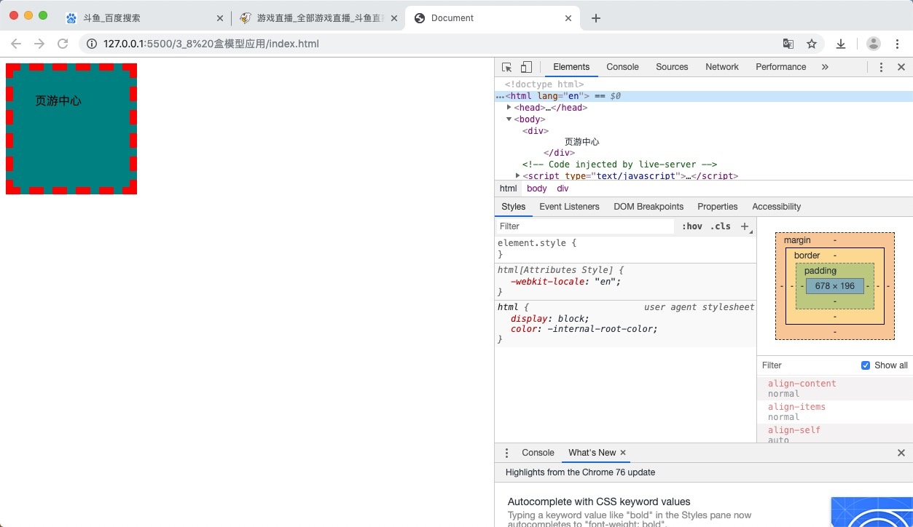

当然我们也可以修改覆盖范围，不过一般情况下不需要

background-clip

- borderbox 背景覆盖边框盒
- padding-box 背景只覆盖填充盒
- content-box 背景只覆盖内容盒

## 3. 溢出处理

当块盒元素内容很多，而对块盒元素又设置了固定宽度，高度的时候，就会出现溢出的情况

```html
<!DOCTYPE html>
<html lang="en">
<head>
    <meta charset="UTF-8">
    <meta name="viewport" content="width=device-width, initial-scale=1.0">
    <meta http-equiv="X-UA-Compatible" content="ie=edge">
    <title>Document</title>
    <style>
        div{
           width: 300px;
           height: 100px;
           border: 3px solid;
        }
    </style>
</head>
<body>
    <div>
        Lorem ipsum dolor, sit amet consectetur adipisicing elit. Fuga numquam, impedit doloremque at doloribus porro, culpa quod perferendis accusamus facilis iusto cumque laborum perspiciatis, sunt ut. Eius nobis neque incidunt!
    </div>
</body>
</html>
```
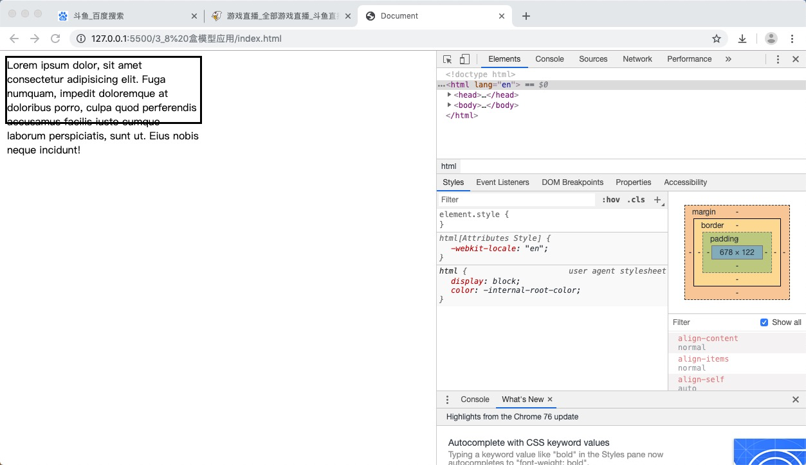

针对于溢出元素的处理，有相关的属性控制

**overflow属性**

**速写属性 实际分为两个属性 overflow-x, overflow-y**
- hidden 溢出部分隐藏
```css
div{
    width: 300px;
    height: 100px;
    border: 3px solid;
    overflow: hidden;
}
```
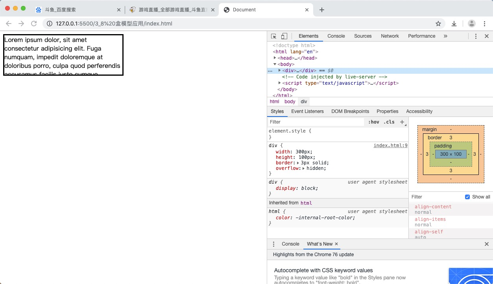
- scroll 滚动效果

```css
div{
    width: 300px;
    height: 100px;
    border: 3px solid;
    overflow: scroll;
}
```
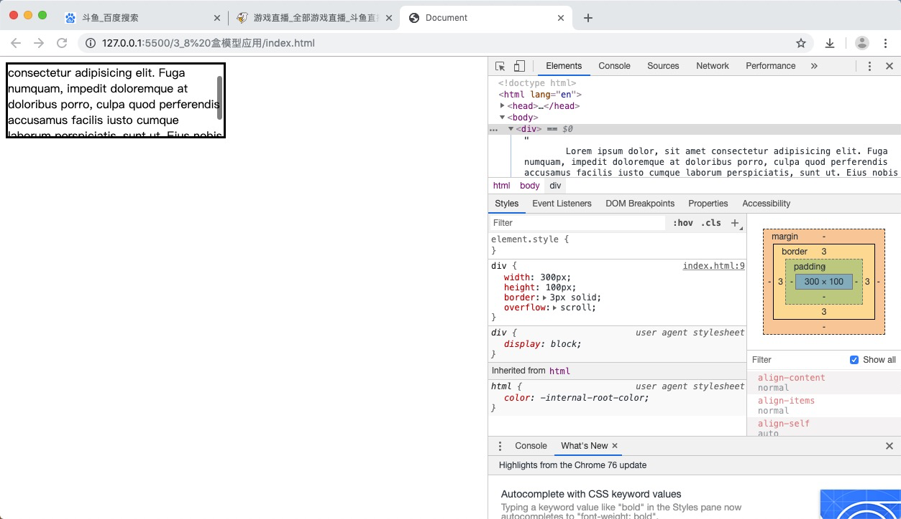
- auto 当溢出时自动增加滚动效果
```css
div{
    width: 300px;
    height: 100px;
    border: 3px solid;
    overflow: auto;
}
```

## 4. 断词规则

先来看一个图片

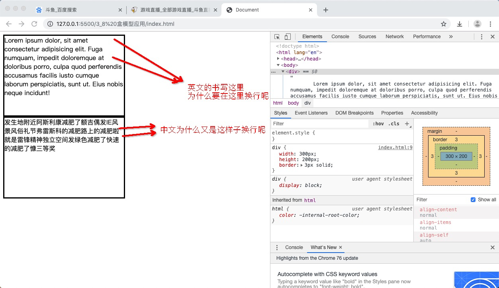

如上所示，为什么英文和中文的换行规则不一样呢，这里就提到了断词规则,什么时候换行，什么位置换行，是由断词规则决定的。

**word-break 属性**

- normal：普通 (默认值)

对于CJK字符（China，Japan, Korean），在文字位置截断
对于非CJK字符（西班牙语，葡萄牙语，阿拉伯语，英语），在单词之间截断

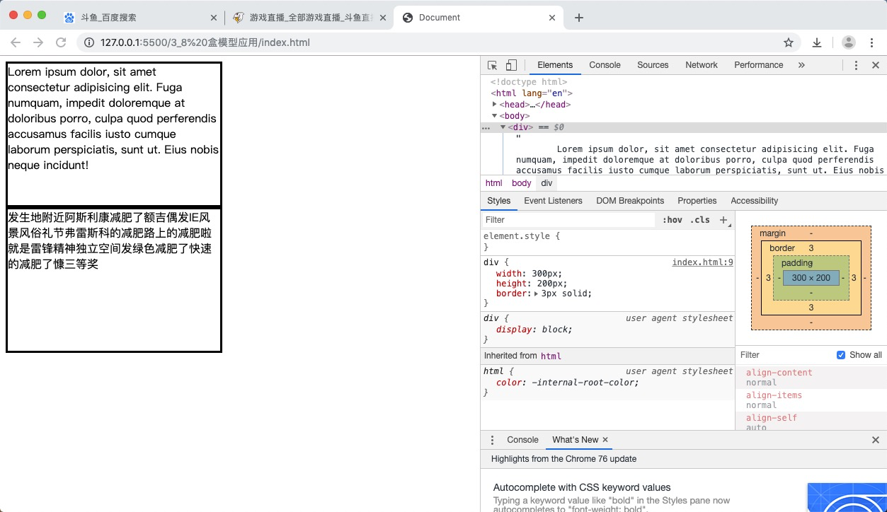

- break-all：截断所有

所有的都在文字处截断

```css
div{
    width: 300px;
    height: 200px;
    border: 3px solid;
    word-break: break-all;
}
```
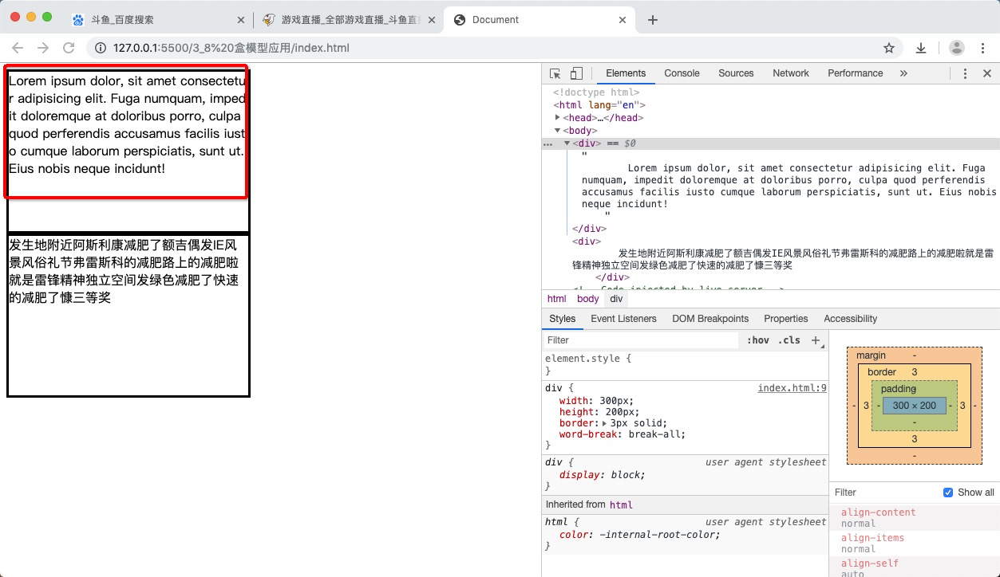

- keep-all: 保持所有

所有文字都在单词处截断

```css
div{
    width: 300px;
    height: 200px;
    border: 3px solid;
    word-break: keep-all;
}
```
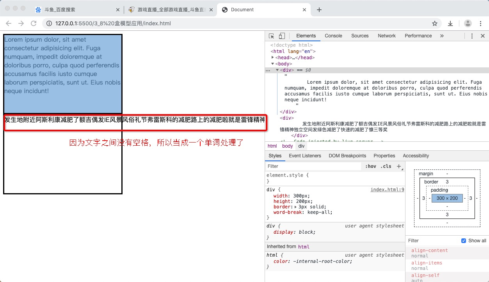


## 5 空白处理

有些时候，我要在网页显示一段信息，显示不下了，显示不下要溢出，我要进行溢出处理，比较友好的处理

如下图所示

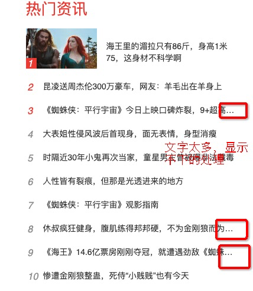

### 实例操作

先大概做出单行文字的效果

```html
<!DOCTYPE html>
<html lang="en">
<head>
    <meta charset="UTF-8">
    <meta name="viewport" content="width=device-width, initial-scale=1.0">
    <meta http-equiv="X-UA-Compatible" content="ie=edge">
    <title>Document</title>
    <style>
        li{
            border-bottom: 1px dashed #ccc;
            line-height: 2;
            border-left: 3px solid #008c8c;
            padding-left: 10px;
            margin: 1em 0;
        }
    </style>
</head>
<body>
    <ul>
        <li>Lorem ipsum dolor sit amet.</li>
        <li>Temporibus illo recusandae alias enim?</li>
        <li>Quidem cupiditate fuga iste quos.</li>
        <li>Quod pariatur maxime itaque blanditiis?</li>
        <li>Dolorem vero inventore ducimus temporibus.</li>
        <li>Optio ab cumque quod itaque?</li>
        <li>Hic laboriosam tenetur a optio!</li>
        <li>Sed sit blanditiis illo provident?</li>
        <li>Hic accusantium voluptas non atque.</li>
        <li>Quas perspiciatis odio doloremque aliquam!</li>
    </ul>
</body>
</html>
```
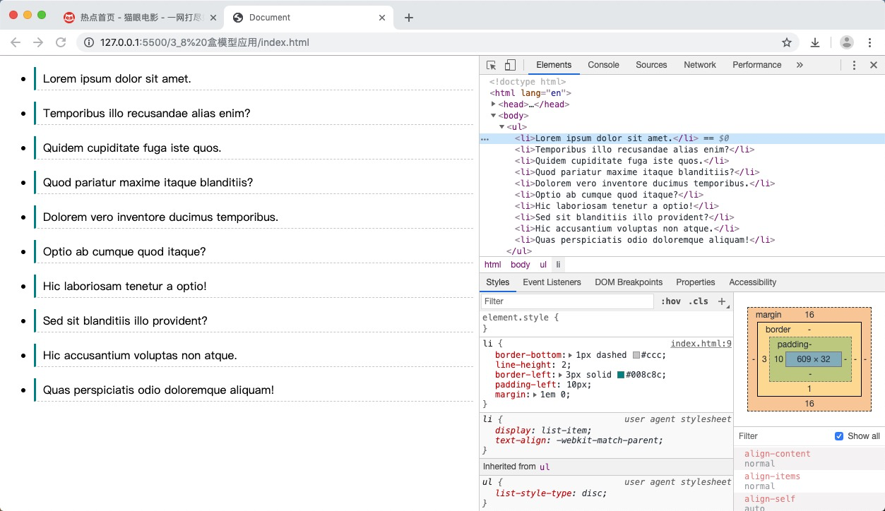

但是当给每个段 加上 width 属性时
```css
li{
    border-bottom: 1px dashed #ccc;
    line-height: 2;
    border-left: 3px solid #008c8c;
    padding-left: 10px;
    margin: 1em 0;
    width: 200px;
}
```

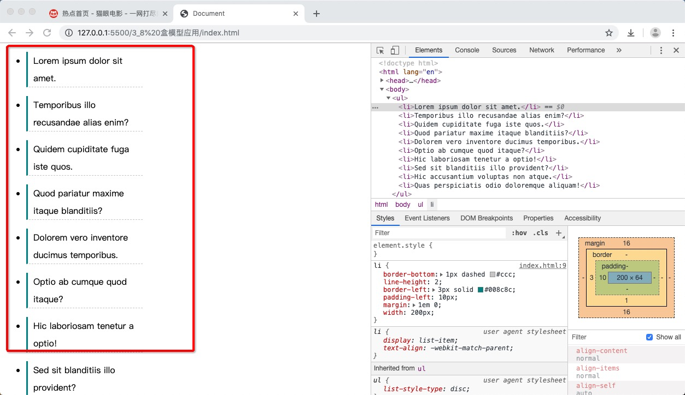

出现换行了，这显然不是我们想要的，我们想要的是一行上 

这里设置 white-space 属性

```css
li{
    border-bottom: 1px dashed #ccc;
    line-height: 2;
    border-left: 3px solid #008c8c;
    padding-left: 10px;
    margin: 1em 0;
    width: 200px;
    /*单行文本不换行*/
    white-space: nowrap;
}
```
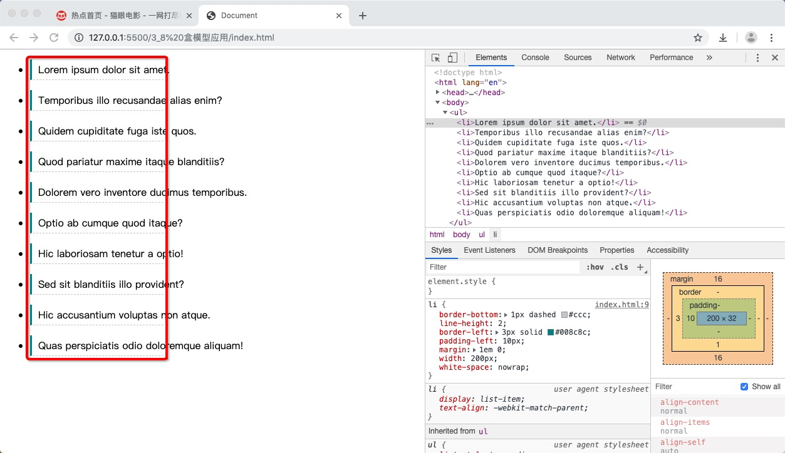

不换行之后发现，有溢出，继续溢出处理 overflow

```css
li{
    border-bottom: 1px dashed #ccc;
    line-height: 2;
    border-left: 3px solid #008c8c;
    padding-left: 10px;
    margin: 1em 0;
    width: 200px;
    white-space: nowrap;
    /*溢出处理*/
    overflow: hidden;
}
```

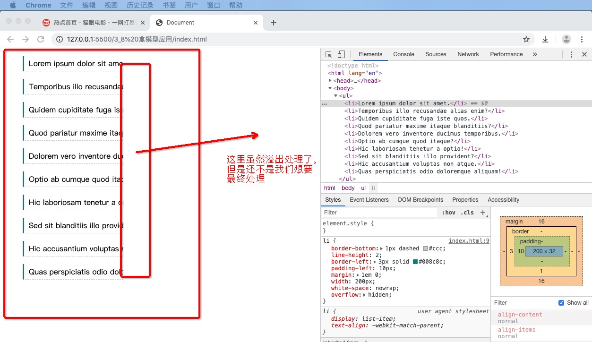

这里需要一个属性 text-overflow


```css
li{
    border-bottom: 1px dashed #ccc;
    line-height: 2;
    border-left: 3px solid #008c8c;
    padding-left: 10px;
    margin: 1em 0;
    width: 200px;
    white-space: nowrap;
    overflow: hidden;
    /*单行文本的溢出处理*/
    text-overflow: ellipsis;
}
```
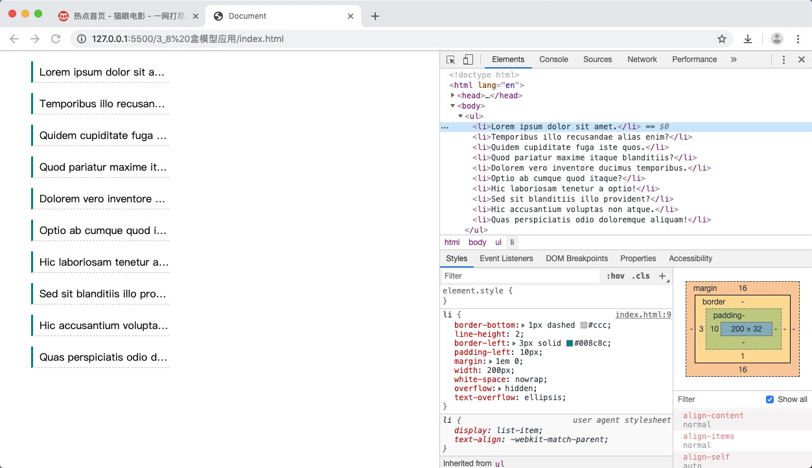

效果出来了，我们改一下width 为300个像素

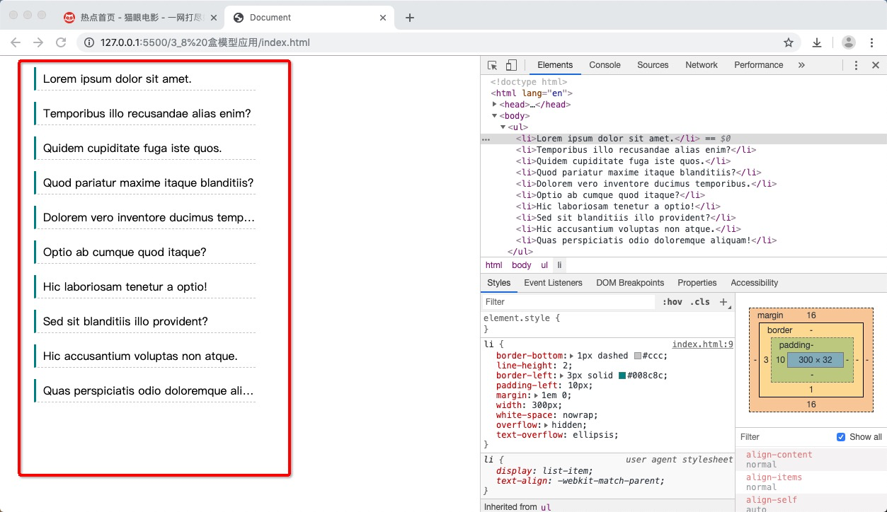


**注意：对于多行文本的空白处理，就不能用如上的方法了，需要引入js的知识**


